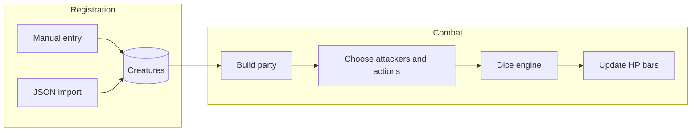
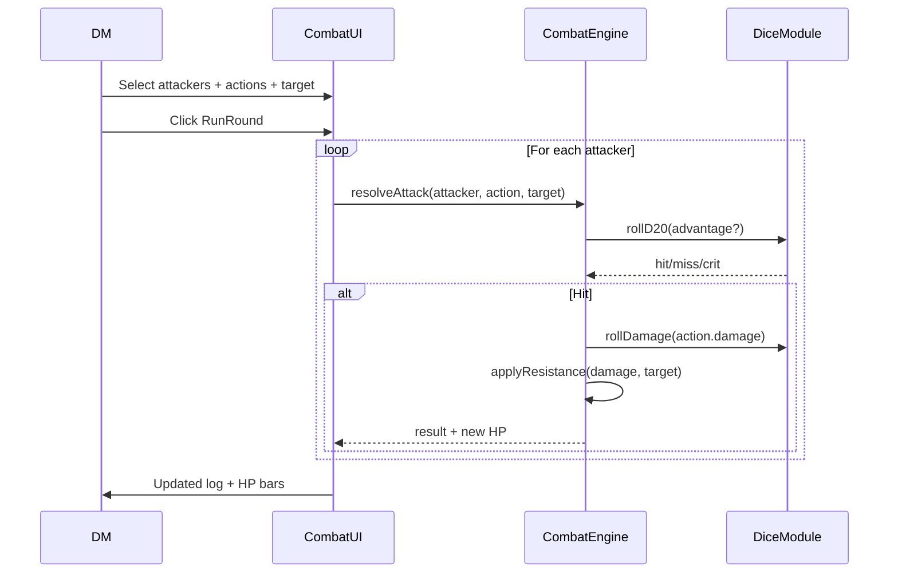

# Bellion — D&D 5e App Plan

## Product vision

Web tool for Dungeon Masters to manage creatures and run monster combats against targets. Main flow:



---

## Recommended stack

| Layer | Choice | Why |
|-------|--------|-----|
| Framework | **Next.js 15 (App Router)** | Full-stack in one repo, API routes, easy deploy (Vercel), SSR for stat block pages |
| Language | **TypeScript** | End-to-end typed creature schema |
| DB | **MongoDB** | Native JSON, flexible schema for varied stat blocks, direct import |
| ODM | **Mongoose** | Validation + hooks; better fit than relational ORMs for nested Mongo documents (actions, traits) |
| Validation | **Zod** | Shared Bellion schema across import, API, and forms |
| UI | **Tailwind CSS + shadcn/ui** | Solid base; customization for dark fantasy aesthetic |
| Client state | **Zustand** | Encounter/combat state without boilerplate |
| Tests | **Vitest** | Dice engine needs reliable unit tests |

**Alternative considered:** PostgreSQL + JSONB — better if the future includes multi-tenant support, shared campaigns, or complex relational queries. For a solo-DM MVP, Mongo is the right choice.

---

## Data model (Bellion schema)

### `Creature` (template — library)

```typescript
// packages/shared or src/lib/schemas/creature.ts
Creature {
  id, name, size, type, alignment, cr
  ac: { value, type? }
  hp: { average, formula }        // e.g. "8d8+16"
  speed: { walk?, fly?, swim?, ... }
  stats: { str, dex, con, int, wis, cha }
  savingThrows?, skills?, damageResistances?, damageImmunities?,
  damageVulnerabilities?, conditionImmunities?, senses, languages
  traits: Trait[]                 // passive features
  actions: Action[]               // attacks and active abilities
  bonusActions?, reactions?
  source?: string                 // "manual" | "import"
  importedAt?, createdAt, updatedAt
}

Action {
  name, description?
  attackBonus?, reach?, range?
  damage?: { dice: string, type: DamageType }[]  // "2d6+3", "slashing"
  saveDC?, saveAbility?           // MVP: basic support, simplified UI
}
```

### `Encounter` (combat session)

```typescript
Encounter {
  id, name, createdAt
  combatants: Combatant[]         // instances on the table
}

Combatant {
  creatureId, instanceName        // e.g. "Goblin #2"
  currentHp, maxHp
  tempHp?, conditions[]           // MVP: simple list, no full automation
  initiative?, isActive
}
```

### `CombatLog` (optional M3+)

Turn-by-turn roll history for UI auditability.

---

## Dice engine (app core)

Isolated module in `src/lib/dice/` — testable, no React dependency:

- **`parseDice("2d6+3")`** → roll AST
- **`roll(expression)`** → result + breakdown (each individual die)
- **`rollD20({ advantage, disadvantage, modifier })`** → 5e rule: advantage + disadvantage cancel
- **`resolveAttack({ attackBonus, targetAc, advantage })`** → hit/miss/crit
- **`resolveDamage({ dice, resistances })`** → applies half/double/immune

MVP 5e criterion: natural 20 = critical hit (double damage dice, not modifier).

---

## Design system (no IP references)

Visual direction described in `AGENTS.md` as **"Arcane Terminal"**:

- **Palette:** background `#080b12`, panels `#12182a` with subtle luminous borders; electric cyan + aged gold + deep red accents for damage
- **Typography:** dramatic display serif (e.g. Cinzel) for titles; geometric sans (Geist/Inter) for numbers and stats
- **Components:** cards with ornamental corners (CSS/SVG), light glassmorphism, hover glow
- **HP bar:** segmented gradient bar; impact animation when taking damage; color changes by thresholds (green → yellow → red)
- **Dice:** 3D or SVG icon with rolling animation; battle-feed style roll log
- **Layout:** sidebar for party, central area for target/action selection, bottom panel for combat log

---

## Milestones

### M0 — Foundation (week 1)

- Scaffold Next.js 15 + TypeScript + Tailwind + shadcn/ui
- MongoDB connection (local Docker Compose for dev)
- Create root `AGENTS.md` with conventions, glossary, and design rules
- Create `docs/` with:
  - `docs/ROADMAP.md` — milestones and done criteria
  - `docs/SCHEMA.md` — Bellion JSON schema with examples
  - `docs/ARCHITECTURE.md` — module diagram
- Zod `CreatureSchema` + sample JSON fixtures (Goblin, Owlbear)

**Done when:** `pnpm dev` starts, Mongo connects, `AGENTS.md` and docs exist.

---

### M1 — Creature library (week 2)

- CRUD API: `GET/POST/PUT/DELETE /api/creatures`
- **Library** page — list with search/filter by CR and type
- **Create/Edit** page — manual form with all schema fields
- **Import JSON** — upload or paste; Zod validation; preview before saving; field-by-field errors
- **Detail** page — rendered stat block (read-only, character-sheet style)

**Done when:** manually-created and JSON-imported creatures persist and appear in the library.

---

### M2 — Dice engine + single combat (week 3)

- Implement `src/lib/dice/*` with Vitest tests (≥15 cases: advantage, disadvantage, crit, resistance)
- **Dice sandbox** page — test isolated rolls
- **Quick combat** page — 1 attacker vs 1 target:
  - Select action
  - Toggle advantage/disadvantage
  - Automatic roll (attack + damage)
  - Apply damage with manual resistance (dropdown: normal/half/double/immune)

**Done when:** rolls match basic 5e rules and tests pass.

---

### M3 — Encounter / monster party (week 4)

- `Encounter` CRUD with multiple combatants (instances of the same or different creatures)
- **Combat table** UI:
  - Party panel: HP bar per monster, instance name
  - Multi-attacker selection (checkboxes)
  - Action selection per attacker (or default action for all)
  - **"Run round"** button — rolls everything in sequence, detailed log
  - Single target in MVP (multi-target stays for a future milestone)
- Encounter persistence in Mongo

**Done when:** party of 3+ monsters attacks a target, HP updates, log shows each roll.

---

### M4 — Visual polish + UX (week 5)

- Apply "Arcane Terminal" design system across all pages
- Animations: dice roll, damage impact, HP transition
- Responsive layout (tablet-first; mobile secondary)
- Empty states, loading skeletons, error toasts
- Export encounter as JSON (backup)

**Done when:** app has a cohesive visual identity and combat flow feels smooth.

---

### M5 — Hardening (week 6, optional)

- Seed script with popular SRD creatures
- Documented environment variables (`.env.example`)
- Vercel + MongoDB Atlas deploy
- Basic API rate limiting
- (Future) auth with NextAuth if multi-user support becomes necessary

---

## Proposed folder structure

```
bellion/
├── AGENTS.md
├── docs/
│   ├── ROADMAP.md
│   ├── SCHEMA.md
│   └── ARCHITECTURE.md
├── docker-compose.yml          # Local Mongo
├── src/
│   ├── app/
│   │   ├── page.tsx            # Dashboard
│   │   ├── library/            # Creature list
│   │   ├── creatures/[id]/     # Detail + edit
│   │   ├── import/             # JSON import
│   │   ├── combat/[id]/        # Combat table
│   │   └── api/
│   │       ├── creatures/
│   │       └── encounters/
│   ├── components/
│   │   ├── creature/           # StatBlock, CreatureForm
│   │   ├── combat/             # PartyPanel, HpBar, ActionPicker, DiceLog
│   │   └── ui/                 # shadcn + custom ArcaneTerminal
│   ├── lib/
│   │   ├── dice/               # Dice engine
│   │   ├── schemas/            # Zod schemas
│   │   ├── db/                 # Mongoose models
│   │   └── combat/             # Round orchestration
│   └── stores/
│       └── combat-store.ts     # Zustand
└── tests/
    └── dice/
```

---

## `AGENTS.md` content

Planned sections:

1. **Purpose** — DM tool for D&D 5e creatures and monster combat
2. **Stack and commands** — `pnpm dev`, `pnpm test`, `docker compose up`
3. **Domain glossary** — Creature (template), Combatant (instance), Encounter, Action, Arcane Terminal (design system)
4. **Implementation rules**
   - Every roll goes through `src/lib/dice/` (never scattered `Math.random`)
   - Zod schemas are the source of truth; Mongoose mirrors them
   - Combat components do not contain rules logic — they delegate to `lib/combat/`
5. **Design** — palette, typography, visual tone (dark fantasy + luminous arcane-terminal panels; no specific-work references)
6. **What to avoid** — over-engineering full 5e rules in the MVP; complex spellcasting; multi-target before M5
7. **Code conventions** — TypeScript strict, English names in code, English UI unless product copy later chooses otherwise

---

## Combat flow (MVP)



---

## Risks and mitigations

| Risk | Mitigation |
|------|------------|
| Stat blocks are too complex for manual form entry | Tabbed form (Basic / Combat / Actions); JSON import as the happy path |
| 5e edge cases | Tested dice engine; UI allows manual override of final damage |
| Inconsistent design system | Centralized CSS tokens in `globals.css` + documentation in `AGENTS.md` |
| Mongo schema drift | Zod validates input; migrations via scripts if needed |

---

## Next step

Execute **M0**: scaffold the project, add `docker-compose.yml` for Mongo, and generate `AGENTS.md` + `docs/*` with the detailed content above.
