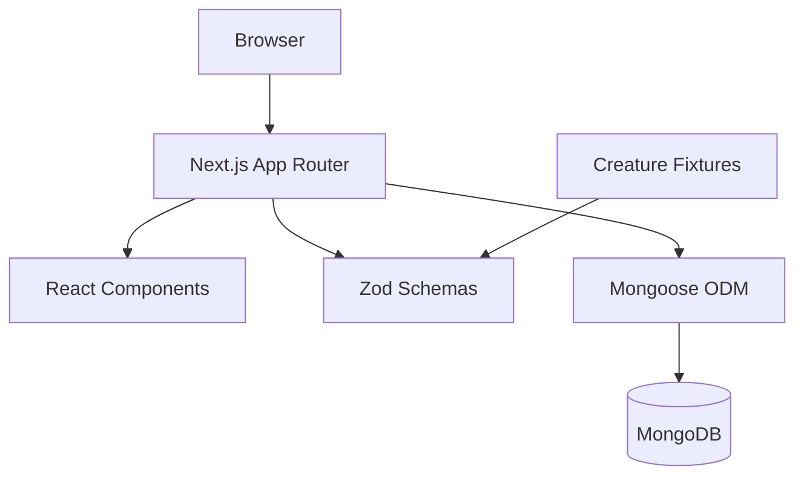
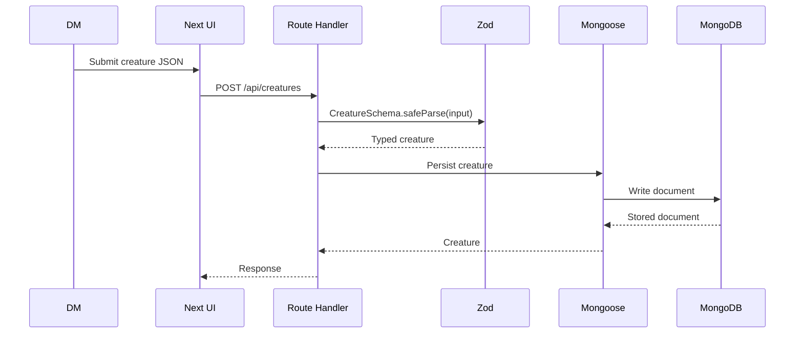
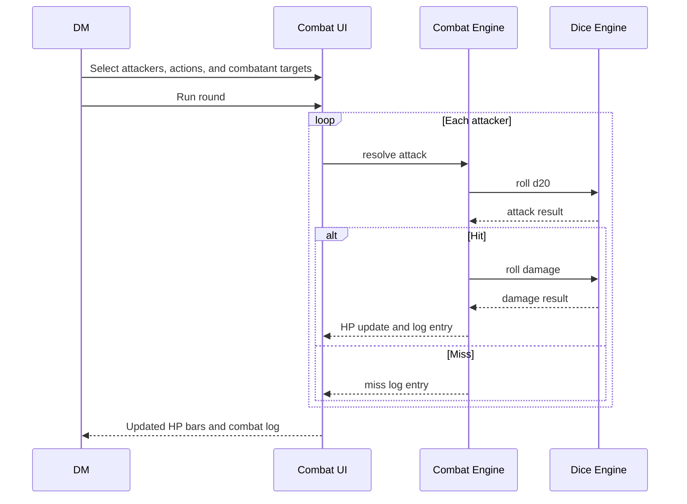

# Royal Bellion Architecture

## Current Stack

## Module Boundaries

- `src/app/`: route-level UI, layouts, and future API route handlers.
- `src/components/ui/`: shadcn/ui primitives and reusable UI building blocks.
- `src/components/creature/`: creature-specific UI.
- `src/components/combat/`: encounter and combat table UI.
- `src/lib/schemas/`: Zod schemas and inferred domain types.
- `src/lib/db/`: Mongoose connection and future models.
- `src/lib/dice/`: dice parser and roller. No React dependency.
- `src/lib/combat/`: combat rules and round orchestration. No React dependency.
- `fixtures/`: checked-in examples and seed-ready domain data.
- `scripts/`: command-line validation and maintenance scripts.

## Data Flow

## Combat Flow

## Local Development

- Next.js runs with `pnpm dev`.
- MongoDB runs with `docker compose up -d`.
- The app connects through `MONGODB_URI`.
- `.env.example` documents the local default connection string.
- `pnpm validate:mongo` verifies the Mongoose connection.

## Design Boundary

Arcane Terminal is the UI direction:

- dense DM tooling
- dark background
- luminous borders
- cyan primary actions
- aged gold accents
- red damage states
- clear, scannable combat telemetry

Avoid making core app screens into marketing pages.
