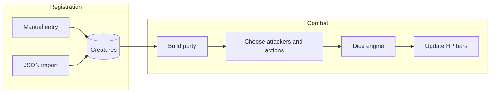

# Bellion Roadmap

## Product Vision

Bellion is a web tool for Dungeon Masters to manage D&D 5e creature templates, import JSON stat blocks, build monster parties, and run combat against targets with auditable dice output.

## M0 - Foundation

- Scaffold Next.js 15 with TypeScript, Tailwind CSS, and shadcn/ui.
- Configure local MongoDB with Docker Compose.
- Add Mongoose ODM connection helper.
- Add root `AGENTS.md` with conventions, glossary, and Arcane Terminal UI rules.
- Split canonical planning into `docs/ROADMAP.md`, `docs/SCHEMA.md`, and `docs/ARCHITECTURE.md`.
- Add Zod `CreatureSchema` and sample fixtures for Goblin and Owlbear.

Done when:

- `pnpm dev` starts cleanly.
- The home page renders without runtime errors.
- Local MongoDB runs through Docker Compose.
- `pnpm validate:mongo` connects to MongoDB.
- `pnpm validate:fixtures` validates creature fixtures.
- `AGENTS.md` and canonical docs exist.

## M1 - Creature Library

- CRUD API: `GET`, `POST`, `PUT`, and `DELETE /api/creatures`.
- Library page with search and filters by CR and type.
- Create/edit page with manual form for schema fields.
- Import JSON flow with Zod validation, preview, and field-level errors.
- Detail page with read-only stat block rendering.

Done when:

- Manually-created and JSON-imported creatures persist and appear in the library.

## M2 - Dice Engine and Single Combat

- Implement `src/lib/dice/*` with Vitest tests.
- Cover advantage, disadvantage, crits, resistance, immunity, vulnerability, and modifiers.
- Add dice sandbox page.
- Add quick combat page for one attacker against one target.
- Resolve attack rolls, damage rolls, and manual resistance mode.

Done when:

- Rolls match core 5e expectations and tests pass.

## M3 - Encounter and Monster Party

- Add encounter CRUD.
- Support multiple combatants, including repeated instances of the same creature.
- Add combat table UI with party panel, HP bars, attacker selection, action selection, and combat log.
- Add "Run round" flow that resolves selected attackers in sequence.
- Persist encounters in MongoDB.

Done when:

- A party of three or more monsters can attack a target, update HP, and record each roll in the log.

## M4 - Visual Polish and UX

- Apply Arcane Terminal design across pages.
- Add shadcn/ui checkbox, label, card, alert, skeleton, and shared form primitives.
- Add dice roll, damage impact, and HP transition animations.
- Add responsive tablet-first layout.
- Add empty states, loading skeletons, and error feedback.
- Add JSON export for encounters.

Done when:

- The app has cohesive visual identity and the combat flow feels smooth.

Status: **Done**

## M5 - Hardening

- Add seed script with SRD-style creature fixtures.
- Document environment variables.
- Prepare Vercel and MongoDB Atlas deploy path.
- Add basic API rate limiting.
- Consider auth only if multi-user support becomes necessary.

Done when:

- The MVP is deployable, documented, and resilient enough for regular solo-DM use.
